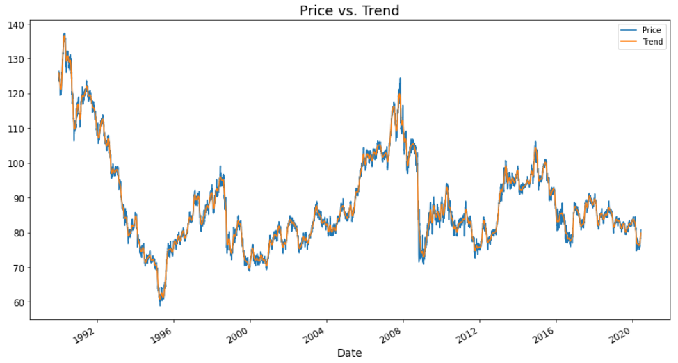
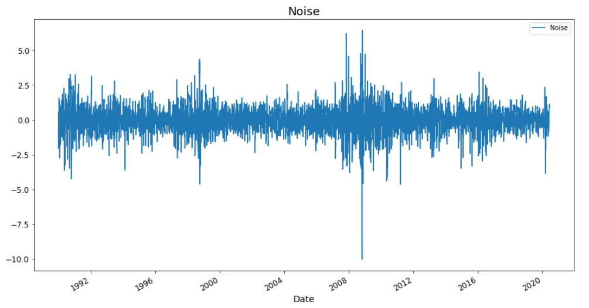
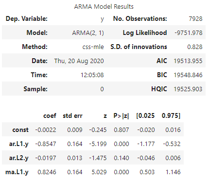
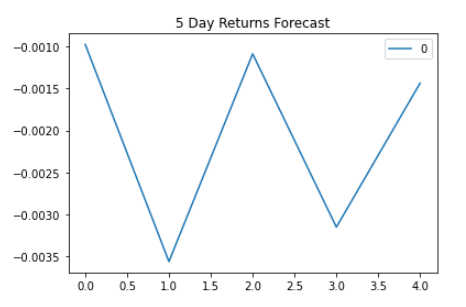
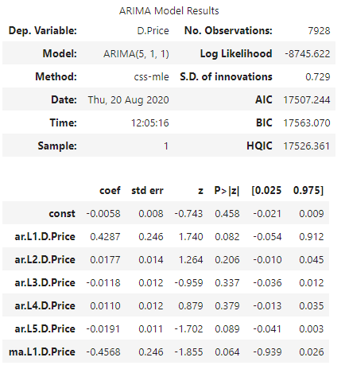
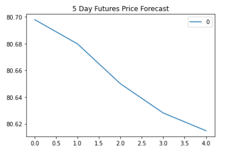
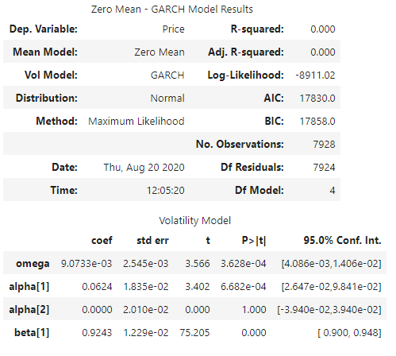
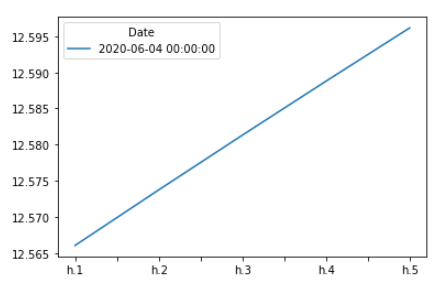
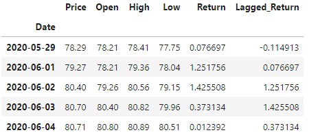
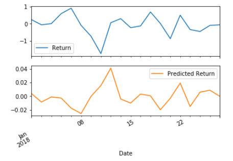

# CADJPY-Time-Series-Analysis

Project Goal:
In this project I aim to test several time series tools in order to predict future movements in the value of the Canadian dollar vs. the Japanese Yen. 

**Jupyter Notebooks:**

(i)***Time Series Notebook:*** in this notebook I first parse the historical futures price data for CAD/JPY and then go through several time series analysis tools. 

*Step by Step process:*
1. Decomposition using a Hodrick-Prescott filter (decompose the settle price into trend and noise).
2. Forecasting returns using an ARMA model.
3. Forecasting the exchange rate price using an ARIMA model.
4. Forecasting volatility with GARCH.

Link to notebook:
[Time-Series Notebook](time_series_analysis.ipynb)

(ii)***Linear Regression Analysis:*** in this notebook I built a Scikit-Learn linear regression model to predict CAD/JPY returns with lagged CAD/JPY futures returns and categorical calendar seasonal effects.

*Step by Step process:*

1. Data preparation (creating returns and lagged returns, and splitting the data into training and testing data)
2. Fitting a linear regression model.
3. Making predictions using the testing data.
4. Out-of-sample performance.
5. In-sample performance.

Link to notebook:
[Regression Analysis Notebook](regression_analysis.ipynb)

## Time Series Analysis Results
***

After preparing the data and creating the dataframe of historical CAD/JPY price data, I decomposed this price data into trend and noise components using a Hodrick-Prescott Filter (HP filter). Results shown below:

Next I used the ARMA model to forecast future returns. Below is shown the ARMA model results:

And below is the forecasted future returns over 5 days:

***ARMA Model takeways:*** Based on the p-values shown above, this ARMA model isn't a great fit as only the AR and MA lag 1 values are under my 0.05 threshold. Therefore I may be using unreliable coefficients that are going to lead to misleading results.

Next I used the ARIMA model to forecast future CAD/JPY exchange rate price. Below is the summary results of the ARIMA model:

Below is the 5 day Futures Price Forecast (using this ARIMA model):

***ARIMA Model takeways:*** Based on the model results, we would expect the Japanese Yen to decline against CAD over the next 5 days. However judging from the pvalues, this is a poor model as none of the coefficients had p-values under our statistically significant threshold of 0.05.

Lastly, I used a GARCH Model to forecast near-term volatility of the CAD/JPY daily returns. Below is the summary results of the GARCH model:

And below is the forecast short term volatility in CAD/JPY returns over future 5 days:

***GARCH Model takeways:*** Based on the graph above, the forecast for CAD/JPY volatility is that it is expected to rise over the next 5 days. The p-values for the GARCH model are far lower than the ARMA/ARIMA. Outside the of the alpha(2) p-value, all are significant, indicating overall a much better model performance. In other words, forecasting future volatility (in the short term) is easier than future returns.

## Linear Regression Model Conclusions
***

Shown below is the dataframe created of the CAD/JPY returns (based on the daily futures price data) and the lagged returns (calculated using the shift function)

After fitting the linear regresion model to the training data, I then used this model to predict future returns based on the test data. Shown below is the first 20 predictions on the returns versus the actual 20 day returns.

Out-of-Sample Root Mean Squared Error (RMSE): 0.6445

In-sample Root Mean Squared Error (RMSE): 0.8342

To conclude based on the RMSE values above, we can see that the model performs quite a bit better on in-sample data versus out-of-sample data. As shown in the chart above, while the model seems to capture some of the direction of the actual CAD/JPY returns, the model fails to accurately predict the actual returns.

